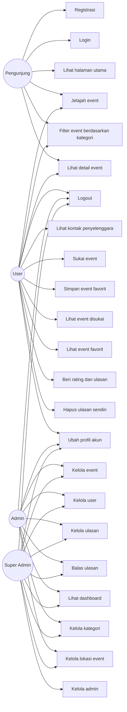
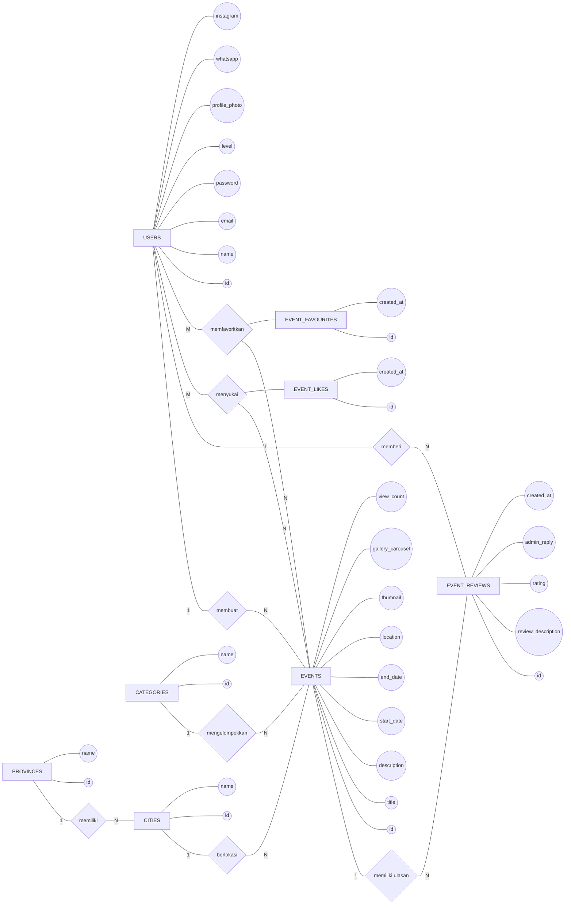
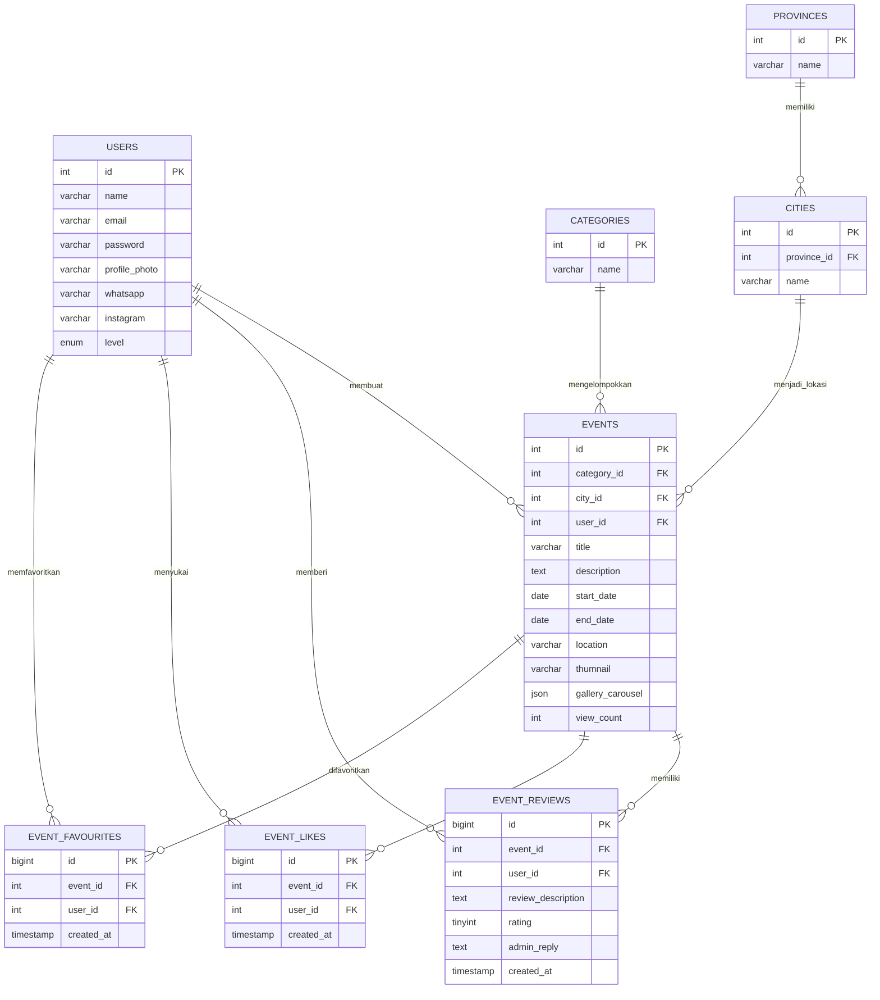

# Use Case dan ERD Chen EvenTura

Dokumen ini disusun berdasarkan struktur project PHP EvenTura, query pada folder `process`, halaman `admin`, `super admin`, serta migrasi pada folder `sql`.

## Aktor

1. **Pengunjung**
   - Pengguna yang belum login.
   - Dapat melihat halaman utama, menjelajah event, melihat detail event, login, dan registrasi.

2. **User**
   - Pengguna yang sudah registrasi dan login dengan level `user`.
   - Dapat menyukai event, menyimpan event favorit, memberi ulasan/rating, menghapus ulasan miliknya, dan mengatur akun.

3. **Admin**
   - Pengguna dengan level `admin`.
   - Dapat mengelola event miliknya, mengelola user, membalas/menghapus ulasan pada event miliknya, melihat dashboard, dan mengatur akun.

4. **Super Admin**
   - Pengguna dengan level `super_admin`.
   - Dapat mengelola seluruh data event, admin, user, ulasan, dashboard, dan pengaturan akun.

## Use Case Diagram

## Deskripsi Use Case

| Kode | Use Case | Aktor | Deskripsi |
| --- | --- | --- | --- |
| UC-01 | Registrasi | Pengunjung | Pengunjung membuat akun baru sebagai user. |
| UC-02 | Login | Pengunjung | Pengunjung masuk ke sistem menggunakan email dan password. |
| UC-03 | Logout | User, Admin, Super Admin | Aktor keluar dari sesi sistem. |
| UC-04 | Lihat halaman utama | Pengunjung | Pengunjung melihat landing page dan ringkasan event. |
| UC-05 | Jelajah event | Pengunjung, User | Aktor melihat daftar event yang tersedia. |
| UC-06 | Filter event berdasarkan kategori | Pengunjung, User | Aktor menyaring event berdasarkan kategori Budaya, Musik, atau Seni. |
| UC-07 | Lihat detail event | Pengunjung, User | Aktor melihat detail event, galeri, lokasi, tanggal, kategori, dan ulasan. |
| UC-08 | Lihat kontak penyelenggara | User | User melihat kontak admin penyelenggara event, seperti WhatsApp dan Instagram. |
| UC-09 | Sukai event | User | User menambah atau menghapus tanda suka pada event. |
| UC-10 | Simpan event favorit | User | User menambah atau menghapus event dari daftar favorit. |
| UC-11 | Lihat event disukai | User | User melihat daftar event yang pernah disukai. |
| UC-12 | Lihat event favorit | User | User melihat daftar event yang disimpan sebagai favorit. |
| UC-13 | Beri rating dan ulasan | User | User memberi rating dan komentar pada event. |
| UC-14 | Hapus ulasan sendiri | User | User menghapus ulasan yang dibuatnya sendiri. |
| UC-15 | Ubah profil akun | User, Admin, Super Admin | Aktor mengubah nama, email, password, foto profil, dan kontak sosial bila tersedia. |
| UC-16 | Kelola event | Admin, Super Admin | Admin membuat, membaca, mengubah, dan menghapus data event. Admin biasa hanya mengelola event miliknya, sedangkan super admin dapat mengelola semua event. |
| UC-17 | Kelola user | Admin, Super Admin | Admin dan super admin mengelola data user. |
| UC-18 | Kelola admin | Super Admin | Super admin membuat, mengubah, dan menghapus akun admin. |
| UC-19 | Kelola ulasan | Admin, Super Admin | Admin melihat dan menghapus ulasan pada event miliknya. Super admin mengelola seluruh ulasan. |
| UC-20 | Balas ulasan | Admin, Super Admin | Admin atau super admin memberi balasan pada ulasan event. |
| UC-21 | Lihat dashboard | Admin, Super Admin | Aktor melihat statistik event, user, ulasan, like, favorit, dan performa event. |
| UC-22 | Kelola kategori | Admin, Super Admin | Sistem dapat mengambil atau membuat kategori event saat event dibuat/diubah. |
| UC-23 | Kelola lokasi event | Admin, Super Admin | Aktor memilih provinsi dan kota untuk lokasi event. |

## Skenario Utama Use Case Penting

### UC-01 Registrasi

- **Aktor:** Pengunjung
- **Prasyarat:** Pengunjung belum memiliki akun.
- **Alur utama:**
  1. Pengunjung membuka halaman registrasi.
  2. Pengunjung mengisi nama, email, dan password.
  3. Sistem memeriksa apakah email sudah terdaftar.
  4. Sistem menyimpan akun baru dengan level `user`.
  5. Sistem membuat sesi login untuk user.
- **Hasil:** User berhasil terdaftar dan masuk ke sistem.

### UC-07 Lihat Detail Event

- **Aktor:** Pengunjung, User
- **Prasyarat:** Event tersedia.
- **Alur utama:**
  1. Aktor memilih event dari daftar event.
  2. Sistem menampilkan detail event.
  3. Sistem menampilkan kategori, kota, tanggal, lokasi, thumbnail, galeri, dan ulasan.
  4. Sistem menambah jumlah view event satu kali per sesi.
- **Hasil:** Detail event tampil.

### UC-09 Sukai Event

- **Aktor:** User
- **Prasyarat:** User sudah login dan event tersedia.
- **Alur utama:**
  1. User menekan tombol suka.
  2. Sistem memeriksa apakah user sudah menyukai event tersebut.
  3. Jika belum, sistem menyimpan data ke `event_likes`.
  4. Jika sudah, sistem menghapus data dari `event_likes`.
- **Hasil:** Status suka event berubah.

### UC-10 Simpan Event Favorit

- **Aktor:** User
- **Prasyarat:** User sudah login dan event tersedia.
- **Alur utama:**
  1. User menekan tombol favorit.
  2. Sistem memeriksa apakah event sudah ada di daftar favorit user.
  3. Jika belum, sistem menyimpan data ke `event_favourites`.
  4. Jika sudah, sistem menghapus data dari `event_favourites`.
- **Hasil:** Status favorit event berubah.

### UC-13 Beri Rating dan Ulasan

- **Aktor:** User
- **Prasyarat:** User sudah login dan event tersedia.
- **Alur utama:**
  1. User membuka detail event.
  2. User mengisi rating dan deskripsi ulasan.
  3. Sistem menyimpan ulasan ke `event_reviews`.
  4. Sistem menampilkan ulasan pada halaman detail event.
- **Hasil:** Ulasan dan rating event tersimpan.

### UC-16 Kelola Event

- **Aktor:** Admin, Super Admin
- **Prasyarat:** Aktor sudah login sebagai admin atau super admin.
- **Alur utama:**
  1. Aktor membuka halaman manajemen event.
  2. Aktor menambah, mengubah, atau menghapus event.
  3. Sistem menyimpan data event beserta kategori, kota, tanggal, lokasi, thumbnail, dan galeri.
  4. Untuk admin biasa, sistem membatasi data berdasarkan `events.user_id`.
- **Hasil:** Data event berhasil dikelola.

### UC-20 Balas Ulasan

- **Aktor:** Admin, Super Admin
- **Prasyarat:** Ulasan tersedia.
- **Alur utama:**
  1. Aktor membuka halaman ulasan.
  2. Aktor memilih ulasan.
  3. Aktor mengisi balasan.
  4. Sistem menyimpan balasan pada kolom `admin_reply`.
- **Hasil:** Balasan admin tampil pada ulasan.

## Entitas ERD Chen

### USERS

- **Primary key:** `id`
- **Atribut:** `name`, `email`, `password`, `profile_photo`, `whatsapp`, `instagram`, `level`
- **Keterangan:** Menyimpan akun user, admin, dan super admin. Peran dibedakan melalui atribut `level`.

### EVENTS

- **Primary key:** `id`
- **Foreign key:** `category_id`, `city_id`, `user_id`
- **Atribut:** `title`, `description`, `start_date`, `end_date`, `location`, `thumnail`, `gallery_carousel`, `view_count`
- **Keterangan:** Menyimpan data event yang dibuat admin/super admin.

### CATEGORIES

- **Primary key:** `id`
- **Atribut:** `name`
- **Keterangan:** Menyimpan kategori event, seperti Budaya, Musik, dan Seni.

### PROVINCES

- **Primary key:** `id`
- **Atribut:** `name`
- **Keterangan:** Menyimpan data provinsi.

### CITIES

- **Primary key:** `id`
- **Foreign key:** `province_id`
- **Atribut:** `name`
- **Keterangan:** Menyimpan data kota yang berada pada provinsi tertentu.

### EVENT_REVIEWS

- **Primary key:** `id`
- **Foreign key:** `event_id`, `user_id`
- **Atribut:** `review_description`, `rating`, `admin_reply`, `created_at`
- **Keterangan:** Menyimpan ulasan dan rating user terhadap event.

### EVENT_LIKES

- **Primary key:** `id`
- **Foreign key:** `event_id`, `user_id`
- **Atribut:** `created_at`
- **Keterangan:** Menyimpan data event yang disukai user.

### EVENT_FAVOURITES

- **Primary key:** `id`
- **Foreign key:** `event_id`, `user_id`
- **Atribut:** `created_at`
- **Keterangan:** Menyimpan data event favorit user.

## Relasi ERD Chen

| Relasi | Kardinalitas | Penjelasan |
| --- | --- | --- |
| USERS membuat EVENTS | 1 : N | Satu admin dapat membuat banyak event. Satu event dibuat oleh satu admin melalui `events.user_id`. |
| CATEGORIES mengelompokkan EVENTS | 1 : N | Satu kategori dapat memiliki banyak event. Satu event memiliki satu kategori. |
| PROVINCES memiliki CITIES | 1 : N | Satu provinsi memiliki banyak kota. Satu kota berada pada satu provinsi. |
| CITIES menjadi lokasi EVENTS | 1 : N | Satu kota dapat digunakan oleh banyak event. Satu event berada pada satu kota. |
| USERS memberi EVENT_REVIEWS | 1 : N | Satu user dapat memberi banyak ulasan. Satu ulasan dibuat oleh satu user. |
| EVENTS memiliki EVENT_REVIEWS | 1 : N | Satu event dapat memiliki banyak ulasan. Satu ulasan milik satu event. |
| USERS menyukai EVENTS | M : N | Banyak user dapat menyukai banyak event. Direalisasikan melalui entitas asosiasi `EVENT_LIKES`. |
| USERS memfavoritkan EVENTS | M : N | Banyak user dapat memfavoritkan banyak event. Direalisasikan melalui entitas asosiasi `EVENT_FAVOURITES`. |

## ERD Chen dalam Mermaid

Mermaid tidak memiliki notasi Chen murni, jadi diagram berikut memakai bentuk Chen: persegi panjang untuk entitas, belah ketupat untuk relasi, dan lingkaran untuk atribut.

## ERD Relasional Pendukung

Diagram ini lebih mudah dibaca untuk menjelaskan foreign key pada database.

